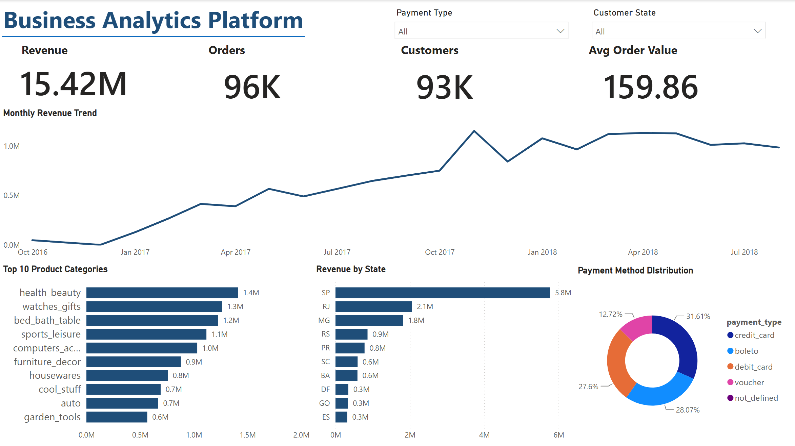
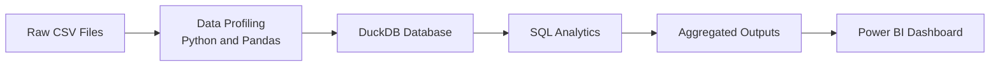

# Brazilian E-Commerce Business Analytics Platform

> An end-to-end business intelligence solution built with Python, DuckDB, SQL, and Power BI using the Olist Brazilian E-Commerce dataset.

This project transforms raw e-commerce transaction data into executive-level insights through data profiling, SQL analytics, automated data exports, and Power BI visualization.

---

## Dashboard Preview

---

## Project Overview

The project simulates a real-world business intelligence workflow for an e-commerce company.

It analyzes:

- Overall revenue and order performance
- Monthly sales trends
- Product category performance
- Geographic revenue distribution
- Customer payment preferences

The final deliverable is an executive dashboard designed to support data-driven decision-making.

---

## Key Business Insights

- The platform generated approximately **R$15.4M** in customer payments from more than **96K completed orders**.
- Revenue grew strongly throughout 2017 before becoming more stable in 2018.
- **Health & Beauty** was the highest revenue-generating product category.
- **São Paulo** contributed the largest share of revenue, indicating significant geographic concentration.
- Credit cards were the dominant payment method.
- Regional marketing outside São Paulo could help diversify the company’s revenue base.

---

## Project Architecture

The analytical workflow is automated through a Python script that executes the SQL pipeline and exports dashboard-ready datasets.

---

## Dataset

This project uses the [Brazilian E-Commerce Public Dataset by Olist](https://www.kaggle.com/datasets/olistbr/brazilian-ecommerce).

The dataset contains information about orders, customers, products, sellers, payments, reviews, and delivery activity across the Brazilian e-commerce marketplace.

### Data Model

*Source: Olist Brazilian E-Commerce Dataset*

---

## Technology Stack

| Technology | Application |
|---|---|
| Python and Pandas | Data profiling, validation, and pipeline execution |
| DuckDB | Local analytical database |
| SQL | KPI calculation and business analysis |
| Power BI | Executive dashboard and visualization |
| Git and GitHub | Version control and project documentation |

---

## Methodology Note

Revenue is defined as the sum of 'payment_value', representing the amount actually paid by customers.

Item-level totals calculated using 'price + freight_value' were used as a validation measure. Because some orders contained differences between item totals and customer payments, 'payment_value' was retained as the primary revenue metric.

---

## Skills Demonstrated

'SQL Analytics' · 'Data Profiling' · 'KPI Development' · 'DuckDB' · 'Python Automation' · 'Power BI' · 'Business Intelligence'